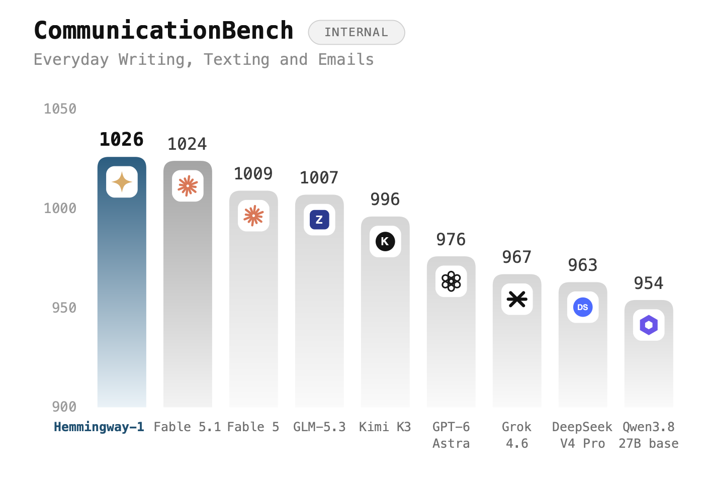
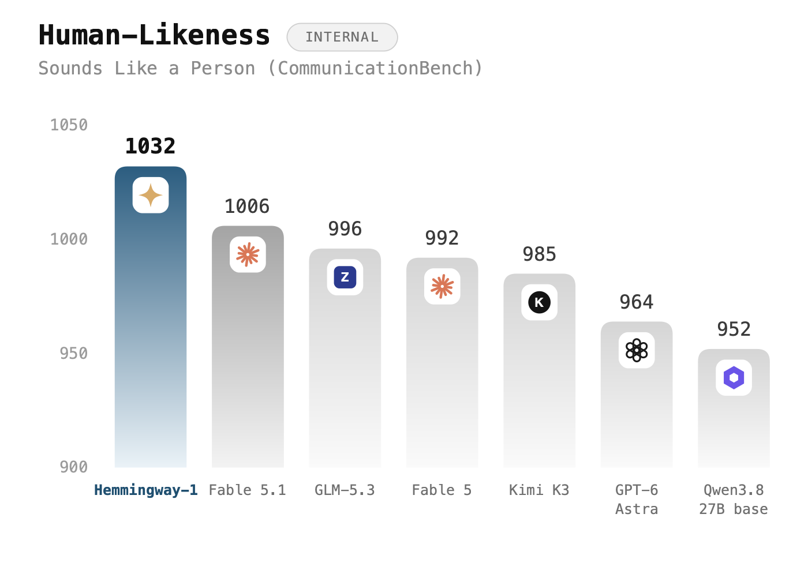
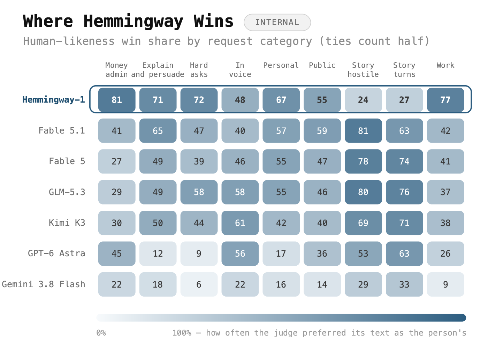
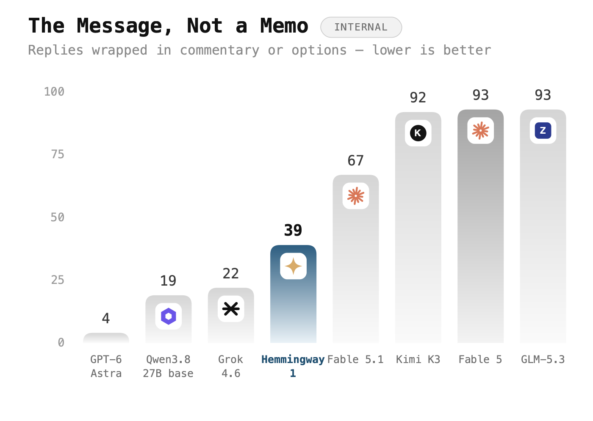
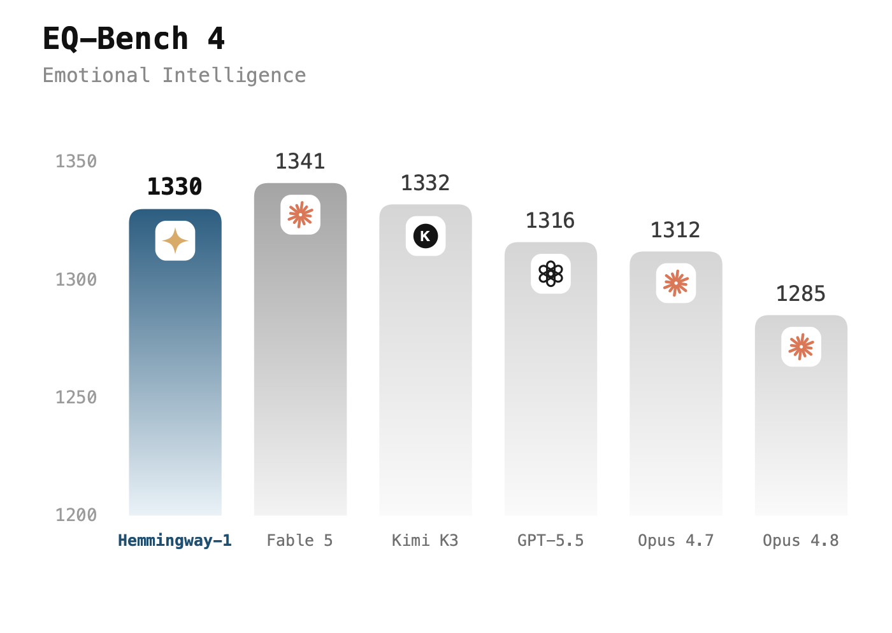
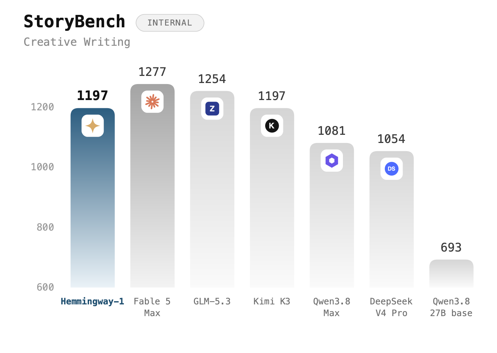

# Hemmingway-1

**The AI that writes like a person.** 27B parameters, open weights, free for non-commercial use.

**[Weights →](https://huggingface.co/Altworld/Hemmingway-1)** · **[Try it →](https://hemmingway.io)** · **[Mac and Android apps →](https://hemmingway.io/download)** · **[Code →](https://github.com/lukeckprobierts/Hemmingway-1)**

Ask most models for a text to your landlord and you get three options, a
preamble, and a paragraph explaining the options. Hemmingway-1 just gives you
the text.

We built it for the writing people actually do every day: messages, emails, the
awkward note to a colleague, the thing you have been putting off. Then we
tested it against the biggest models in the world at exactly that, and it came
first.

## It writes the best everyday messages of any model we tested

We tested on eighty real requests. Every answer went head to head against
another model's answer to the same request, shuffled so the judge never knew
which was which.



It beats Fable 5.1, and it beats GPT-6 Astra by fifty points. Kimi K3, GLM-5.3,
Grok 4.6 and DeepSeek V4 Pro all come in behind it. That is a 27B model.

## And it is the one that sounds like a person

We ran the same matchups again with one question: which of these two did a
person write?



It finished twenty-six points clear of the next model.

## Where it wins

We broke it down by what you asked for. Higher means the judge more often took
its version for the one a person wrote.



It wins on money and admin, work, the hard asks you keep rewriting, and talking
someone round. Most of those by a wide margin. On hard asks, GPT-6 Astra gets
9%. Hemmingway-1 gets 72%.

It loses on hostile storytelling and long story turns. The story models are
better at those, and that is fair.

## You get the message, not a memo

One more thing we measured: how often a model buries the actual text in
commentary, options and notes you have to read past.



Fable 5, GLM-5.3 and Kimi K3 bury it in more than nine replies out of ten.

## It reads the room

EQ-Bench 4 is not ours. It is the public emotional-intelligence benchmark,
run by its own harness.



It placed third, past GPT-5.5, Opus 4.7 and Opus 4.8, and inside twelve points
of the best model on the board.

## It tells a decent story too



It sits level with Kimi K3, comfortably past Qwen3.8-Max and DeepSeek V4 Pro,
and 504 points above the model we started from.

## Run it

```bash
vllm serve Altworld/Hemmingway-1 --max-model-len 262144
```

```python
from transformers import AutoModelForCausalLM, AutoTokenizer

model_id = "Altworld/Hemmingway-1"
tok = AutoTokenizer.from_pretrained(model_id)
model = AutoModelForCausalLM.from_pretrained(model_id, device_map="auto", dtype="auto")

messages = [{"role": "user", "content": "Write the text I send my landlord about the broken boiler."}]
ids = tok.apply_chat_template(messages, add_generation_prompt=True, return_tensors="pt").to(model.device)
out = model.generate(ids, max_new_tokens=512)
print(tok.decode(out[0][ids.shape[-1]:], skip_special_tokens=True))
```

| | |
|---|---|
| Parameters | 27B |
| Built on | Qwen3.8-27B |
| Context | 262,144 tokens |
| Licence | CC BY-NC 4.0, free for non-commercial use; commercial use by agreement |

## Licence

Hemmingway-1 is free for personal, research and other non-commercial use under
[CC BY-NC 4.0](https://creativecommons.org/licenses/by-nc/4.0/). Download it, run
it, fine-tune it and share it, as long as you credit Hemmingway-1.

Commercial use needs a separate agreement with us. We are happy to work with
anyone who reaches out: luka@hemmingway.io

## The fine print

Full disclosure: CommunicationBench, Human-Likeness and StoryBench are our own
benchmarks. We built them, we ran them, and we are saying that up front. Every
matchup was blind and run in both orders so position could not sway the result,
and the judge was a different model from the ones being judged. EQ-Bench 4 is
not ours.

It is English-first. It can be wrong and still sound certain about it. So do
not use it to decide anything medical, legal or financial.

