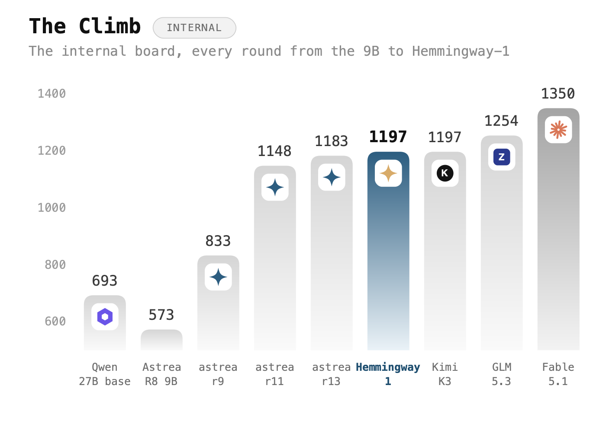

# Hemmingway-1

**The AI that writes like a person.** 27B parameters, open weights, Apache-2.0.

**[Try it →](https://hemmingway.io)** · **[Mac and Android apps →](https://hemmingway.io/download)** · **[Code →](https://github.com/lukeckprobierts/Hemmingway-1)**

Most models can write. Almost none can write the message you were actually
going to send. Ask one for a text to your landlord and you get three options, a
preamble, and a paragraph explaining the options. Hemmingway-1 gives you the
text.

We built it for the writing people do every day — messages, emails, the awkward
note to a colleague, the thing you've been putting off — and then we tested it
against the biggest models in the world at exactly that.

It came first.

## It writes the best everyday messages of any model we tested

Eighty real requests. Every answer put head to head with another model's answer
to the same request, shuffled so the judge never knows which is which.


Ahead of Fable 5.1. Ahead of GPT-6 Astra by fifty points. Ahead of Kimi K3,
GLM-5.3, Grok 4.6 and DeepSeek V4 Pro. At 27B.

## And it's the one that sounds like a person

Same matchups, one question: which of these two did a person write?


Twenty-six points clear of the next model. This is the whole point of
Hemmingway-1, and it's the number we're proudest of.

## Where it wins

Broken down by what you actually asked for. Higher means the judge more often
took its version for the one a person wrote.


Money and admin, work, the hard asks you keep rewriting, talking someone round
— it wins all of them, most by a wide margin. GPT-6 Astra gets 9% on hard asks.
Hemmingway-1 gets 72%.

Where it loses is hostile storytelling and long story turns. The story models
are better at those. We'd rather win your inbox.

## You get the message, not a memo

How often a model buries the actual text in commentary, options and notes you
have to read past.


Fable 5, GLM-5.3 and Kimi K3 do it to more than nine replies in ten.

## It reads the room

EQ-Bench 4 is not ours. It's the public emotional-intelligence benchmark, run
by its own harness.


Third, past GPT-5.5, Opus 4.7 and Opus 4.8, and inside twelve points of the
best model on the board.

## It tells a decent story too


Level with Kimi K3, comfortably past Qwen3.8-Max and DeepSeek V4 Pro, and 504
points above the model we started from.

## How it got here

Every round, from our first 9B to this one.



## Run it

```bash
vllm serve Altworld/Hemmingway-1 --max-model-len 262144
```

```python
from transformers import AutoModelForCausalLM, AutoTokenizer

model_id = "Altworld/Hemmingway-1"
tok = AutoTokenizer.from_pretrained(model_id)
model = AutoModelForCausalLM.from_pretrained(model_id, device_map="auto", dtype="auto")

messages = [{"role": "user", "content": "Write the text I send my landlord about the broken boiler."}]
ids = tok.apply_chat_template(messages, add_generation_prompt=True, return_tensors="pt").to(model.device)
out = model.generate(ids, max_new_tokens=512)
print(tok.decode(out[0][ids.shape[-1]:], skip_special_tokens=True))
```

| | |
|---|---|
| Parameters | 27B |
| Built on | Qwen3.8-27B |
| Context | 262,144 tokens |
| Licence | Apache-2.0 — yours to use, including commercially |

## The fine print

CommunicationBench, Human-Likeness and StoryBench are our own benchmarks. We
built them, we ran them, and we're telling you that up front. Every matchup was
blind and run in both orders so position couldn't sway it, and the judge was a
different model from the ones being judged. EQ-Bench 4 and its slop meter are
not ours.

It's English-first. It can be wrong and still sound certain. Don't use it to
decide anything medical, legal or financial.
